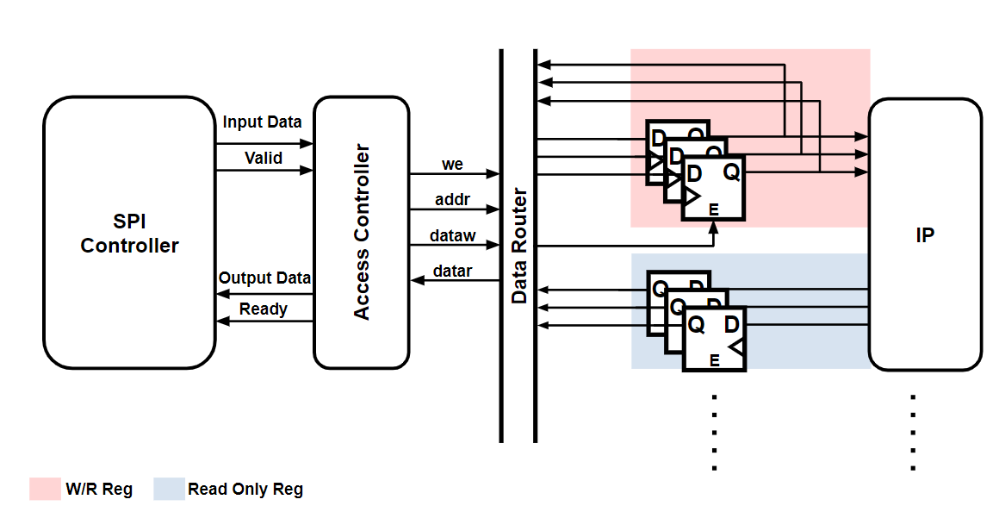

# SPI-Register-Access-Controller
Here you can find the RTL for a SPI+Register bank controller which can be used to test stand-alone Analog/Digital IP

How to set  a register map :
1) Edit ./rtl/reg_bank_generator/src/main/scala/registersMain.scala
2) the  map of registers is defined by a ListBuffer of the reset values which is also used to determine the bitwidth of each individual register
```
	var initial_regwr= new ListBuffer[UInt]()
	//AFE
	initial_regwr += 129.U(8.W)//AFE MATCHING R[7:0]
	initial_regwr += 255.U(8.W)//AFE R
	initial_regwr += 0.U(4.W)//AFE Cs
	initial_regwr += 0.U(2.W)//AFE BIAS
```
The above example shows the configuration needed to generate a bank of 4 registers for AFE testing : 
2 of 8bits, 1 of 4bits, 1 of 2bits. 
The reset values for those registers will be 129, 255 and 0.

The controller has been tested on simulation and fpga. 
In the directory scripts, you will find a python scripts  used to control the ftdi c232h usb to serial converter  to stimulate the spi slave interface.

See directory docs for more documentation.

Potential imporvements are :

1)  Now the core requires manual setup on the rtl parameters to set the number of registers and the maximum bit width, when trying to regenerate a new registers map.
Port the serial interface and the access controller to chisel in order to reduce the amount of manual setup when setting a registersmap by uniquifying the parameters.
2) The core was synthetized usgin close tools that require licences, I'm not able to share. Would be good to have the setup needed to generate a gds using OpenLane
3) Need to write the setup to run the testbench on a free simulator.
